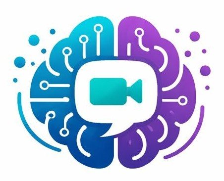
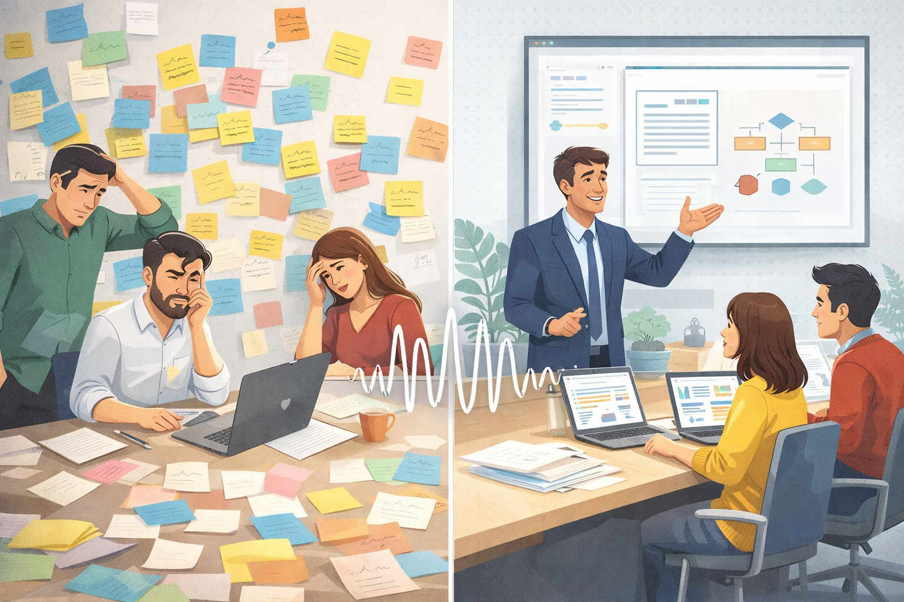
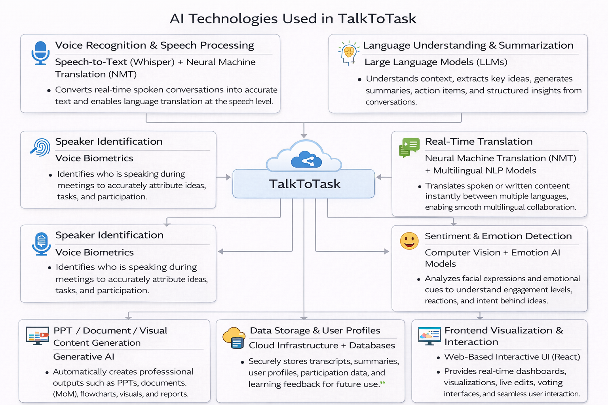
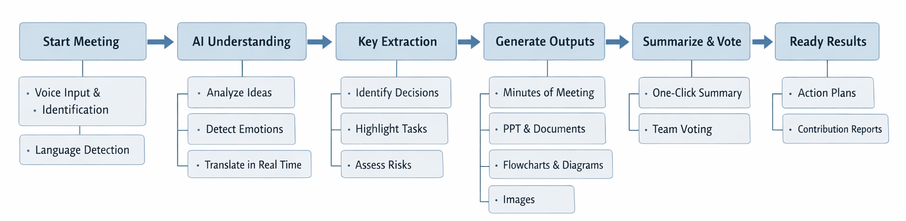
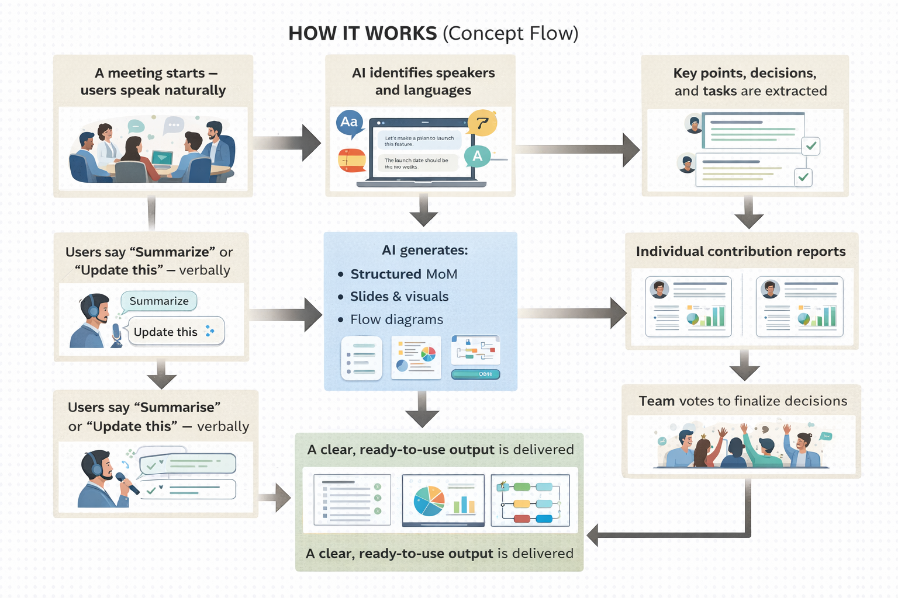
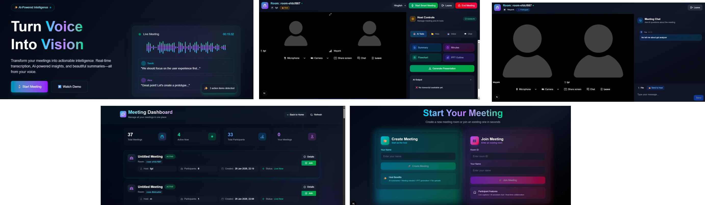

<h1 style="font-weight: 900; font-size: 3rem;">
  
  Talk2Task
</h1>

<h3 style="font-weight: 600; margin-top: -10px; font-style: italic;">
  "From Spoken Ideas to Structured Outcomes"
</h3>

## 🚀 Project Overview

  
  

**Talk2Task** is an AI-powered, voice-first meeting and idea intelligence platform that converts live conversations into structured, professional, and execution-ready outputs like **PPTs, Minutes of Meeting (MoM), reports, and visual diagrams**.
It is built for **students, startups, companies, hackathon teams, and innovators** who want productive meetings without manual effort.

## 💡 Core Idea (Simple & Clear)

People speak naturally during discussions.  
👉 **Talk2Task listens in real time, understands who is speaking, in which language, with what intent and emotion, structures ideas intelligently, and instantly generates actionable outputs.**
**No typing. No language barriers. No missed ideas.**

## ❗ Problem → Solution

**Problem:**  
Meetings are usually unstructured, multilingual, time-consuming, and require manual documentation.
**Solution:**  
Talk2Task uses AI to automatically **capture, understand, organize, and visualize discussions in real time**, eliminating manual effort.

---
## ⭐ Why Talk2Task is Unique (USPs)

- 🎤 Voice-first collaboration (speak naturally)
- 🌍 Multilingual understanding with real-time translation
- 🧠 True meeting intelligence (understands meaning, not just audio)
- 📊 One-click generation of PPTs, MoMs, reports, and visuals
- 🗳️ Built-in voting for faster decision-making
- 🙂 Face & sentiment analysis to track engagement
- ✋ Gesture-based virtual drawing using computer vision
- 📈 Individual participant performance insights

## ⚙️ Key Features

- **Real-Time Voice Recognition** – Captures and transcribes live discussions  
- **Speaker Identification** – Automatically detects who is speaking  
- **Multilingual Voice Capture** – Users can speak in any language  
- **Live Voice Translation** – Instantly translates between participants  
- **Smart Summarization** – Extracts key ideas, decisions, and action items  
- **PPT & MoM Generator** – Creates professional documents instantly  
- **Voting System** – Helps teams finalize ideas and decisions  
- **Face & Emotion Analysis** – Measures engagement and sentiment  
- **Participant Profiling** – Understands domain context (student, developer, business, etc.)  
- **Gesture-Based Drawing** – Draw or write in air on a virtual 2D screen  
- **Individual Reports** – Analyzes communication, creativity, and participation  

---

## 🧠 Technology Stack

- Speech-to-Text (Whisper-like models)
- Multilingual NLP & Neural Machine Translation (NMT)
- Large Language Models (LLMs)
- Computer Vision (Face analysis, Hand tracking)
- Sentiment & Emotion AI
- Multimodal AI (voice, text, image, video, PDFs)
- Web-based Interactive Interface
---

## 🔄 Process Flow Diagram

## 🔁 How It Works vs Outputs Generated

| **How It Works (Flow)** | **Outputs Generated** |
|-------------------------|-----------------------|
| Users start a meeting and speak naturally | PPT presentations |
| AI captures voice and identifies speakers | Minutes of Meeting (MoM) |
| Language detection and real-time translation | Action items with ownership |
| Emotion & engagement analysis | Flowcharts & visual idea maps |
| Optional gesture-based visual input | Video meeting summaries |
| AI structures ideas and insights | Individual participant performance reports |

## 📌 Use Cases · Future Scope · Business Model

| **Use Cases** | **Future Scope** | **Business Model** |
|--------------|----------------|-------------------|
| Hackathons & Ideathons | Integration with Google Meet, Zoom, Teams | SaaS Subscriptions (Basic / Pro / Enterprise) |
| Corporate meetings | Advanced idea ranking using AI scoring | Enterprise licensing |
| Student project discussions | Real-time task assignment & deadline tracking | Pay-per-output model |
| Startup brainstorming sessions | Knowledge base from past meetings | Cloud-based scalable revenue |
| Remote & multilingual teams | Voice-controlled project management | Global scalability |

**Vision: AI layer for every meeting**

## 🚀 Innovation & Novelty

Talk2Task goes beyond traditional meeting tools by combining **voice-first interaction, real-time multilingual intelligence, sentiment awareness, and gesture-based visualization** in a single platform.
Instead of just recording meetings, it **understands conversations, structures ideas intelligently, and converts them into execution-ready assets instantly** — a capability missing in existing tools.

---

## 🧩 System Architecture (Textual Overview)

The system follows a **layered AI architecture**:

- **Input Layer:** Voice, facial expressions, and gestures  
- **Processing Layer:** Speech-to-Text, Computer Vision, Emotion AI  
- **Intelligence Layer:** LLM-based contextual and intent understanding  
- **Decision Layer:** Voting, prioritization, and insights  
- **Output Layer:** PPTs, MoMs, reports, visuals, and summaries  

---
## 📝 Project Abstract

Talk2Task is an AI-powered, voice-first meeting intelligence platform that transforms unstructured, multilingual discussions into structured and actionable outcomes. By leveraging **speech recognition, large language models, computer vision, and sentiment analysis**, the system automatically generates summaries, PPTs, MoMs, visual diagrams, and individual performance insights.
The platform enhances collaboration, improves decision-making through built-in voting, and removes manual documentation effort, making meetings more productive, inclusive, and execution-focused.

---

## 🖼️ Prototype Screenshots

---
## 👥 Team Information

**Name of Innovation:** 🚀 Talk2Task by **MAKSQUARE**

**Team Members:**  
- 👤 Mayank  
- 👤 Anmol Kumar Pandit  
- 👤 Komal Pathak  
- 👤 Kunal Nayak  

---

## 📄 License

This project is licensed under the **MIT License**.  
You are free to use, modify, and distribute this software with proper attribution.

---

## 🤝 Contributions & Collaboration

Contributions, ideas, and feedback are always welcome!  
If you’d like to improve Talk2Task or collaborate, feel free to open an issue or submit a pull request.

---

## 🌐 Connect With Us

📌 Built with passion for **AI-powered collaboration**  
📌 Designed for **students, startups, and global teams**  
📌 Focused on **voice-first, multilingual intelligence**

---

  <strong>✨ From Spoken Ideas to Structured Outcomes ✨</strong>

  © 2026 MAKSQUARE · Talk2Task

